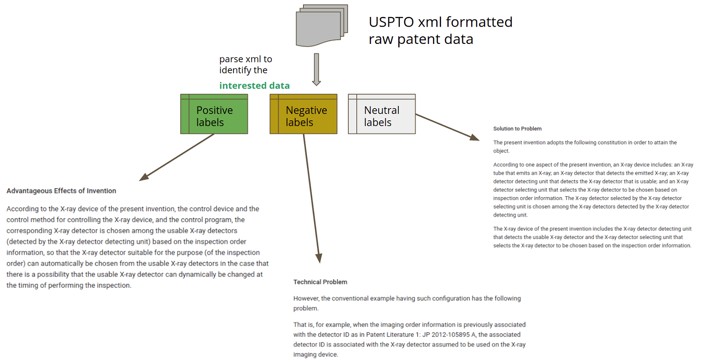

### PaSa: A Novel Dataset for Patent Sentiment Analysis to Highlight Patent Paragraphs

In the process of manual patent analysis, to attain better readability, identifying the semantic information by marking paragraph is in practice. Oftentimes patent examiners and attorneys highlight the text passages which could be essential entities for key arguments when patent documents are compared to the existing literature. The important entities such as technical advantageous of any invention, problems associated with previous efforts, or other plain descriptive texts are manually highlighted by attorneys to compare and contrast indivdual subject matters. This semantic annotation process is laborious and time consuming, to allevate such problem we proposed a novel dataset. The dataset consist of three classes such as 'positive', 'negative', and 'neutral' corresponding to 'technical advantageous of inventios', 'technical problems', and 'other boilerplate text' from patent documents respectively. 

Patents docs, mainly from ASIA expresses the selling points of their invention via section so called " technical advantages", "advantageous effects", "effects of invention", etc. Such section usually have some sentences or a paragraphs which focus on advantages of invention, we call them positive samples in our dataset.
Other section just above advantages, usually explains the idea of invetion or how does it work, etc and we call such sentences or paragraphs as neutral samples in our dataset.
Other class of our dataset is negative samples such as, some sections/senetnces/paragraphs which explains the problems associated with existing approaches listed in patent doc. 

Given a patent document, identifying different annotations (three different classes as above mentioned) would be a very interesting research aspect, which helps the patent practitioners such as examiners, patent attorneys to quickly identify the key arguments of invention, in turn providing a timely marking/highlighting the text of patent. 

Patent grants from USPTO in the year 2020 are referred to create this dataset. USPTO full text bulk datasets are formatted in a xml file per week, eaxh xml is again nested in nature and contain thosdands of grants of that particular week. 
